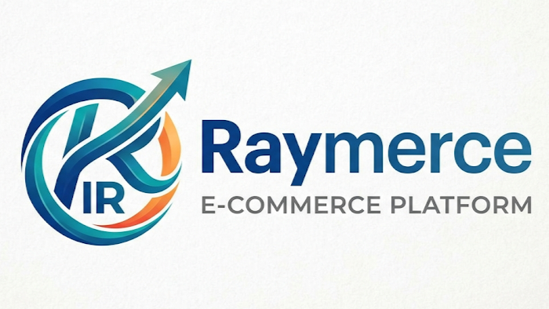

<p align="center">
  
</p>

<p align="center">
  
</p>

<p align="center">
  
</p>

<h2 align="center">🚀 A production-ready e-commerce platform built with the MERN stack.</h2>

<p align="center">
  
  
  
  
</p>

---

# 📋 Raymerce

> *Shop Quality Products at Great Prices.*  
> **Raymerce** is a full-stack e-commerce platform built with production-quality engineering practices.  
> Designed with **React 18**, **Express.js**, **MongoDB Atlas**, and **Tailwind CSS** for speed, scale, and a polished UX.

---

# ✨ Features

- 🔐 **Authentication** — Register, login, and JWT-based protected routes with persistent sessions.
- 👑 **Role-Based Access** — Admin dashboard for product management with user/admin role separation.
- 📦 **Product Management** — Full CRUD operations with image, category, price, stock, and featured flags.
- 🔎 **Smart Search & Filters** — Search by name, filter by category and price range, sort by price/date/name.
- 📄 **Pagination** — 8 products per page with smart page range navigation.
- 🛒 **Shopping Cart** — Add/remove items, adjust quantity, localStorage persistence, real-time badge updates.
- 📊 **Admin Dashboard** — Real-time stats: total products, categories, and low-stock alerts.
- 📱 **Responsive** — Fully responsive design with mobile hamburger menu.
- 🌙 **Dark Mode** — Toggle with persistent preference stored in localStorage.
- 🔔 **Toast Notifications** — Context-based toast system with auto-dismiss for every CRUD operation.
- ⏳ **Loading States** — Skeleton loaders and spinners during async operations.
- 🎯 **Empty States** — Contextual messaging when cart is empty or filters yield no results.

---

# 💡 Why This Project?

This platform demonstrates:

- **MVC Architecture**: Clean separation of models, controllers, and routes.
- **REST API Design**: Consistent endpoint patterns with centralized error handling.
- **UI/UX Focus**: Loading states, empty states, toast feedback, dark mode, and responsive design.
- **Security**: JWT middleware, bcrypt password hashing, role-based authorization.
- **Validation**: Backend input validation with Mongoose + frontend form guards.

---

# 🧩 Tech Stack

| Layer | Technology |
|-------|-----------|
| Frontend | React 18, Vite, Tailwind CSS, React Router v6, Axios |
| Backend | Node.js, Express.js, ES Modules |
| Database | MongoDB Atlas (Mongoose ODM) |
| Auth | JWT (jsonwebtoken), bcryptjs |
| State | localStorage (cart persistence) |
| UI Icons | React Icons (Feather) |
| Notifications | React Hot Toast |
| Deployment | Frontend: Vercel, Backend: Render |

---

# 📂 Project Structure

```plaintext
raymerce/
├── backend/
│   ├── config/          # DB connection
│   ├── controllers/     # Route handlers (auth, product)
│   ├── middleware/      # Auth, error handling
│   ├── models/          # Mongoose schemas (User, Product, Order)
│   ├── routes/          # Express routers
│   ├── utils/           # JWT token helper
│   ├── seed/            # Database seeder
│   ├── .env.example
│   ├── server.js        # Entry point
│   └── package.json
├── frontend/
│   ├── public/          # Static assets (logo, brand, favicon)
│   ├── src/
│   │   ├── components/  # Header, Footer, ProductCard, Paginate, etc.
│   │   ├── pages/       # Home, Product, Cart, Login, Register, Admin
│   │   ├── store/       # Cart store (localStorage)
│   │   ├── api.js       # Axios instance with JWT interceptor
│   │   ├── App.jsx      # Root with routes
│   │   └── main.jsx     # Entry point
│   ├── index.html
│   └── package.json
├── vercel.json           # Vercel deployment config
├── render.yaml           # Render deployment config
├── .gitignore
└── README.md
```

---

# ⚙️ Installation

```bash
git clone https://github.com/yourusername/raymerce.git
cd raymerce
```

---

# ▶️ Run Locally

### Prerequisites
- Node.js 18+
- MongoDB Atlas account (or local MongoDB)

### 1. Configure Backend

```bash
cd backend
cp .env.example .env
# Edit .env with your MongoDB URI and JWT secret
npm install
npm run seed   # Seed database with sample data
npm run dev    # Start backend on port 5000
```

### 2. Configure Frontend

```bash
cd frontend
npm install
npm run dev    # Start frontend on port 3000
```

Open [http://localhost:3000](http://localhost:3000).

### Demo Credentials

| Role | Email | Password |
|------|-------|----------|
| Admin | admin@raymerce.com | admin123 |
| User | user@test.com | user123 |

---

# 📬 API Reference

Base URL: `http://localhost:5000/api`

### Health

| Method | Endpoint | Description |
|--------|----------|-------------|
| GET | `/api/health` | Health check |

### Auth

| Method | Endpoint | Body | Description |
|--------|----------|------|-------------|
| POST | `/api/auth/register` | `{ name, email, password }` | Register user |
| POST | `/api/auth/login` | `{ email, password }` | Login |
| GET | `/api/auth/profile` | — | Get user profile (Bearer token) |

### Products

| Method | Endpoint | Query / Body | Description |
|--------|----------|--------------|-------------|
| GET | `/api/products` | `?keyword=&category=&minPrice=&maxPrice=&sort=&pageNumber=` | List / filter / search / paginate |
| GET | `/api/products/featured` | — | Featured products |
| GET | `/api/products/:id` | — | Get product by ID |
| POST | `/api/products` | `{ name, image?, category, price, description, stock, featured? }` | Create product (Admin) |
| PUT | `/api/products/:id` | `{ name?, image?, category?, price?, description?, stock?, featured? }` | Update product (Admin) |
| DELETE | `/api/products/:id` | — | Delete product (Admin) |

---

# ☁️ Deployment

### Backend on Render

1. Push code to GitHub
2. Create a new Web Service on Render
3. Set root directory to `backend`
4. Build command: `npm install`, Start command: `npm start`
5. Add env vars: `MONGO_URI`, `JWT_SECRET`, `NODE_ENV=production`

### Frontend on Vercel

1. Import GitHub repo on Vercel
2. Framework: Vite, root: `frontend`
3. Add env var: `VITE_API_URL=https://your-backend.onrender.com/api`
4. Deploy

---

# 🧠 How It Works

1. **Browse Products**: Visit the home page to see products in a responsive grid with skeleton loaders.
2. **Search & Filter**: Use the search bar, category dropdown, and price range filters — all sync via URL params.
3. **Product Details**: Click any product to view full details, adjust quantity, and add to cart.
4. **Shopping Cart**: Review items, adjust quantities, or remove items — cart persists in localStorage.
5. **Register / Login**: Create an account or sign in to access admin features.
6. **Admin Dashboard**: View stats, manage products (add, edit, delete with confirmation).

---

# 🌱 Roadmap

- [x] JWT authentication with register/login
- [x] Product CRUD with validation
- [x] Search, filter, sort, and pagination
- [x] Shopping cart with localStorage
- [x] Admin dashboard with stats
- [x] Dark mode toggle
- [x] Skeleton loaders and empty states
- [x] Toast notification system
- [x] Responsive design
- [x] Deployment configs (Vercel + Render)
- [ ] Order management system
- [ ] Payment gateway integration (Stripe/PayPal)
- [ ] Product reviews and ratings
- [ ] User profile management
- [ ] Email notifications

---

# 📜 License

MIT License

---

<p align="center">
  <b>Built with ❤️ by the Raymerce Team</b><br>
  <i>"Shop Quality Products at Great Prices."</i>
</p>
